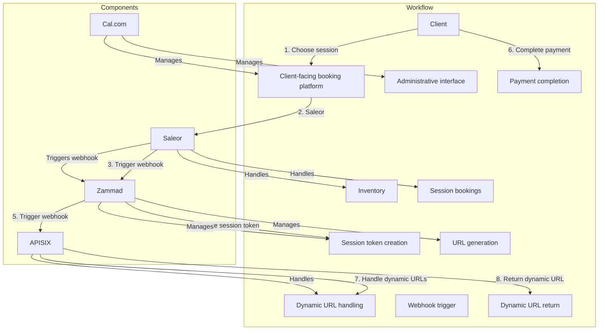

### Components:

1. **Cal.com**: Manages both the client-facing booking platform and the administrative interface without requiring changes to its core functionality.
2. **Saleor**: Handles inventory and session bookings and is responsible for initiating workflows by triggering webhooks post-payment.
3. **Zammad**: Acts as the central workflow engine, creating session tokens and managing the dynamic URL generation process.
4. **APISIX**: Serves as the API Gateway, utilizing an external authentication plugin to interface securely with Zammad, ensuring that dynamic URLs and tokens are handled appropriately.

### Workflow:

1. **Booking and Payment Process**:
   - Clients choose a session and complete payment through the Saleor application.
   - Saleor triggers a webhook to Zammad that notifies of the payment without including session tokens or URLs.
   - Zammad, upon receiving the webhook, creates a token for the session and triggers a webhook to request APISIX to create a dynamic URL.
   - APISIX returns the dynamic URL to Zammad linked to this URL.

function webhook(conf, ctx)

    -- Import necessary libraries
    local http = require("resty.http")
    local core = require("apisix.core")

    -- Send the webhook notification only if the request method is POST
    if core.request.get_method() == "POST" then
        -- Extract the URL from the request body
        local url = core.request.get_body().url

        -- Send the webhook notification to the specified URL
        local httpc = http.new()
        local res, err = httpc:request_uri(url, {
            method = "POST",
            headers = {
                ["Content-Type"] = "application/json"
            },
            body = core.request.get_body(),
        })

        -- Check the response from the webhook
        if not res then
            core.log.error("Failed to send webhook: ", err)
            return 500, err
        end
    end

    -- Return the response from the upstream service
    return conf.status, conf.body

end

2. **Token and URL Management**:

   - Zammad manages the lifecycle of the booking URL and token, ensuring that changes such as rescheduling are possible up to 24 hours before the session. Zammad handles the logic through its tickets capabilities, as each session initiates a ticket.
   -

3. **APISIX External Authentication Plugin**:

   - Utilizes an external authentication plugin to validate sessions and tokens communicated by Zammad, providing secure access to the booking URL.

4. **Dynamic URL Access**:
   - When a client attempts to access the booking URL, APISIX checks for authentication. If unauthenticated, the client is prompted to log in.



### Configuration Steps:

1. **Identify Public Endpoints**: List out all the specific API paths (URLs) that belong to the open website and customer sections of your app.

2. **Configure uri-blocker plugin**: In APISIX, configure the uri-blocker plugin to create rules that allow requests matching the public endpoint paths. You can use regular expressions for flexibility.

Example Configuration (assuming public paths start with "/public" and "/customer"):

```nginx
location / {
  # Allow requests to public and customer paths
  uri_blocker {
    deny_uri = ["^/(?!(public|customer)).*", "/internal/.*"]
  }
  # Your routes and other configuration here...
}
```

Explanation:

- `location /` applies the rule to all incoming requests.
- `uri_blocker` defines the blocking rule.
- `deny_uri` specifies patterns to deny.
  - `^/(?!(public|customer)).*` - This regex matches any path that doesn't start with "/public" or "/customer".
  - `/internal/.*` - This blocks any path that starts with "/internal/" (assuming these are internal API endpoints).

Aim:

- Fine-grained control over exposed endpoints.
- No need to manage user IPs.

Considerations:

- Requires understanding regular expressions for effective configuration.
- Double-check your patterns to avoid accidentally blocking legitimate requests.

Additional Tips:

- You can create separate routes or services in APISIX for public and internal API sections for better organization.
- Remember, APISIX acts as a first line of defense.
